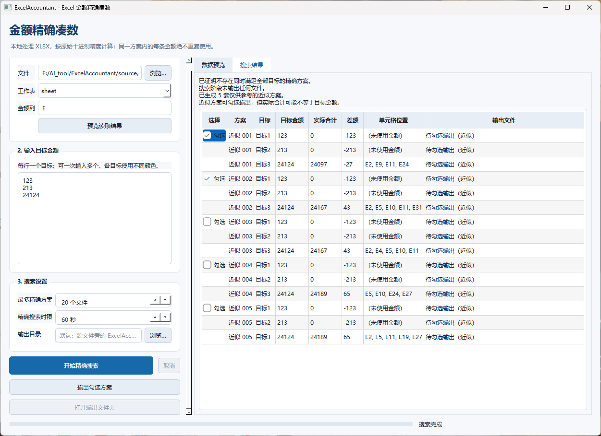

# ExcelAccountant｜Excel 金额精确凑数

[](https://github.com/zwj276765037-lab/ExcelAccountant/releases/latest)


ExcelAccountant 是一个面向对账、报销核销和账目匹配的 Windows 桌面工具。它可以从 Excel 某一列的几百条金额中，寻找任意数量的项目，使合计精确等于一个或多个目标金额，并告诉你每个金额位于哪个单元格。

金额全程采用十进制定点计算，不使用浮点数作为求和真值；软件完全在本机运行，不上传工作簿，也不需要安装 Python、依赖库或 WPS 插件。

## 直接下载

### [⬇️ 下载最新版 ExcelAccountant.exe](https://github.com/zwj276765037-lab/ExcelAccountant/releases/latest/download/ExcelAccountant.exe)

下载后双击即可运行。输出的 `.xlsx` 文件可使用 WPS Office 或 Microsoft Excel 打开。

> 当前版本尚未购买代码签名证书。Windows SmartScreen 首次运行时可能提示“未知发布者”，可在确认文件来自本仓库后选择“更多信息”→“仍要运行”。

## 软件界面



界面左侧负责选择数据、输入目标和设置搜索条件；右侧显示数据预览、精确方案或近似方案。每套方案左侧都有选择框，只有勾选并点击输出后才会生成文件。

## 核心功能

- **精确金额组合**：从指定列中寻找任意数量的金额，使合计精确等于目标值。
- **多个目标同时处理**：每行输入一个目标，同一套方案中不同目标使用不同颜色标记。
- **金额不重复使用**：同一套方案内，一个源单元格只能分配给一个目标。
- **近似备选方案**：无法找到精确组合时，显示最接近目标的方案、实际合计和差额。
- **手动选择后输出**：搜索不会自动写文件，可勾选一套或多套精确/近似方案再统一输出。
- **单元格位置可追溯**：结果中列出组成金额和 `E2`、`E9` 等原始单元格地址。
- **自动高亮与审计**：输出副本高亮命中金额，并附带结果审计工作表。
- **原文件保护**：永不覆盖输入文件，写出后会重新打开并独立校验。

## 基本使用方式

### 1. 选择 Excel 数据

1. 点击“浏览”，选择一个 `.xlsx` 文件。
2. 选择金额所在的工作表。
3. 输入金额列，可以使用以下任一种格式：
   - 列字母：`E`
   - 列序号：`5`
   - 单列范围：`E2:E500`
4. 点击“预览读取结果”，核对有效金额、完整小数和被排除的单元格。

### 2. 输入目标金额

在“输入目标金额”区域每行输入一个目标，例如：

```text
123
213
24124.35
```

输入多个目标时，程序会寻找一套互不重复的金额分配方案，并在同一个输出文件中使用不同颜色标记各个目标。

### 3. 设置并开始搜索

- **最多精确方案**：限制最多显示和输出多少套独立方案。
- **精确搜索时限**：控制本次组合搜索允许使用的时间。
- **输出目录**：可提前指定结果保存位置，留空时使用源文件旁的默认目录。

确认后点击“开始精确搜索”。搜索完成不会自动生成文件。

### 4. 查看并选择方案

- 找到精确组合时，结果会显示目标金额、实际合计、组成金额和单元格地址。
- 当前时限内没有精确组合时，程序会列出近似备选，并明确显示实际合计和差额。
- 每套方案只需勾选第一行左侧的方框，即表示选择整套多目标方案。
- 可以同时勾选多套方案，每套方案分别输出为一个文件。

### 5. 输出结果

点击“输出勾选方案”后，程序才会写入指定目录：

- 精确方案：`原文件名_方案001.xlsx`
- 近似方案：`原文件名_近似方案001.xlsx`

输出近似方案前会再次弹出风险确认。近似结果不等于目标金额，必须根据审计表中的实际合计、有符号差额和绝对差额进行人工复核。

## 金额与输出规则

- 直接读取 XLSX 内部保存的原始数值文本。
- 使用十进制定点整数化计算，不截断、不四舍五入、不主动统一小数位。
- 不会在工作簿已保存精度之上制造新的舍入；Excel/WPS 保存前已经丢失的精度无法恢复。
- 同一套方案内源单元格绝不重复；不同方案是相互独立的输出文件，可以复用相同源项目。
- 同一文件内的不同目标使用不同填充色，只改变被选中的金额单元格。
- 精确文件附带“凑数结果”工作表；近似文件附带“近似凑数结果”工作表。
- 结果先写入临时文件，重新打开并验证金额、地址、颜色和互斥关系后才正式落盘。

## 数据识别规则

可作为候选金额：数值单元格、严格数值文本、正数、负数以及隐藏行中的金额。

不会参与搜索：表头、空白、零值、公式、日期、布尔值、错误值、币种符号或混合文本。预览区会列出被排除的内容；存在非表头异常项时，搜索前会再次请求确认。

## 支持范围与限制

目前支持 Windows 10/11、普通 `.xlsx` 文件、单工作表的单列范围、正负金额以及数百条候选数据。

暂不支持 `.xls`、`.xlsm`、加密工作簿、公式金额和跨表/跨列共同搜索。包含宏、图表、形状、嵌入对象、外部链接、连接或保护等结构时，会触发安全拒绝：程序可以显示求解结果，但不会写回副本。

“任意数量金额求和”属于组合搜索问题。数据越多、目标越多、组合越密集，搜索耗时可能越长。达到时限但没有找到方案，表示“在当前时限内未找到”，并不等同于数学上已经证明无解。

## 隐私说明

程序完全在本机运行，无登录、无上传、无遥测、无云端 API。真实工作簿、`source/`、`output/` 及所有 Excel 输入/输出文件均被 Git 忽略，不会提交到公开仓库。

<details>
<summary><strong>开发与测试</strong></summary>

```powershell
py -3.12 -m venv .venv
.\.venv\Scripts\python.exe -m pip install -r requirements-dev.txt
.\.venv\Scripts\python.exe -m pip install -e .
.\.venv\Scripts\python.exe -m pytest -q
.\.venv\Scripts\python.exe -m excel_accountant
```

实现规格与测试计划：

- `docs/superpowers/specs/2026-09-02-excel-accountant-design.md`
- `docs/superpowers/plans/2026-09-02-excel-accountant-implementation-plan.md`

</details>

<details>
<summary><strong>Windows 打包</strong></summary>

```powershell
.\scripts\build.ps1
```

构建脚本会先运行测试，再生成并冒烟检查两种发布包：

- one-folder：`dist\ExcelAccountant-folder\ExcelAccountant-folder.exe`
- one-file：`dist\ExcelAccountant.exe`

仅在已经单独运行测试时，可使用 `.\scripts\build.ps1 -SkipTests` 跳过构建前测试。

</details>
